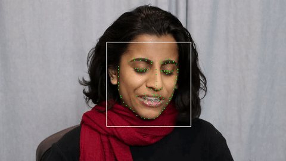

# facial-landmark-detection-hrnet
A TensorFlow implementation of HRNet for facial landmark detection.



Watch this demo video: [HRNet Facial Landmark Detection (bilibili)](https://www.bilibili.com/video/BV1Vy4y1C79p/).

## Features
 - Support multiple public dataset: WFLW, IBUG, etc.
 - Advanced model architecture: HRNet v2
 - Data augmentation: randomly scale/rotate/flip
 - Model optimization: quantization, pruning

## Getting Started

These instructions will get you a copy of the project up and running on your local machine for development and testing purposes.

### Prerequisites


### Installing
#### Get the source code for training

```shell
# From your favorite development directory
git clone --recursive https://github.com/yinguobing/facial-landmark-detection-hrnet.git
```

#### Generate the training data
There are multiple public facial mark datasets available which can be used to generate training heatmaps we need. For this training process the images will be augmented. The first step is transforming  the dataset into a more uniform distribution that is easier to process. You can do this yourself or, use this repo:

```shell
# From your favorite development directory
git clone https://github.com/yinguobing/face-mesh-generator.git

# Checkout the desired branch
git checkout features/export_for_mark_regression
```
Use the module `generate_mesh_dataset.py` to generate training data. Popular public datasets like IBUG, 300-W, WFLW are supported. Checkout the full list here: [facial-landmark-dataset](https://github.com/yinguobing/facial-landmark-dataset).


## Training
Deep neural network training can be complicated as you have to make sure everything is ready like datasets, checkpoints, logs, etc. But do not worry. Following these steps you should be fine.

### Setup the model.

In the module `train.py`, setup your model's name and the number of marks.
```python
# What is the model's name?
name = "hrnetv2"

# How many marks are there for a single face sample?
number_marks = 98
```

### Set the training and testing datasets

These files do not change frequently so set them in the source code. Take WFLW as an example.

```python
# Training data.
train_files_dir = "/path/to/wflw_train"

# Testing data.
test_files_dir = "/path/to/wflw_test"
```

### Set the validation datasets

The loss value from this dataset will be used to decide which checkpoint should be preserved. Set `None` if no files available. Then about 512 of the training files will be used as validation samples.

```python
# Validation data.
val_files_dir = None
```

### Provide a sanity check image

This sample image will be logged into TensorBoard with detected marks drawing on it. In this way you can check the model's behavior visually during training.

```python
sample_image = "docs/face.jpg"
```

### Start training
Set the hyper parameters in the command line.

```Shell
python3 train.py --epochs=80 --batch_size=32
```

Training checkpoints can be found in directory `checkpoints`. Before training started, this directory will be checked and the model will be restored if any checkpoint is available. Only the best model (smallest validation loss) will be saved.

### Resume training
If training was interrupted, resume it by providing `--initial_epoch` argument.

```bash
python3 train.py --epochs=80 --initial_epoch=61
```

### Monitor the training process
Use TensorBoard. The log and profiling files are in directory `logs`

```shell
tensorboard --logdir /path/to/facial-landmark-detection-hrnet/logs

```

### Training speedup
You can download this checkpoint file to speedup the training process.

- [GoogleDrive](https://drive.google.com/file/d/1cQKrYdX0O7DsBodjTufzVzm70gXwsyaP/view?usp=sharing) 
- [百度云盘](https://pan.baidu.com/s/1XDp6hDx_aXYTV5_OF1cc6g) (提取码 b3vm)

## Evaluation
A quick evaluation on validation datasets will be performed automatically after training. For a full evaluation, please run the `evaluate.py` file. The NME value will be printed after evaluation.

```
python3 evaluate.py
```

## Export
Even though the model wights are saved in the checkpoint, it is better to save the entire model so you won't need the source code to restore it. This is useful for inference and model optimization later.

### For cloud/PC applications
Exported model will be saved in `saved_model` format in directory `exported`. You can restore the model with `Keras` directly. Loading the model in OpenCV is also [supported](https://github.com/yinguobing/facial-landmark-detection-hrnet/issues/3).

```shell
python3 train.py --export_only=True
```
### For Android phones, embedded and IoT devices
TensorFlow lite and TensorFlow Model Optimization Toolkit will help you to get a optimized model for these applications. Please follow the instructions of the later section *Optimization*.

### For iPhone
Apple has developed a conversion tool named [coremltools](https://github.com/apple/coremltools) which can convert and quantize the TensorFlow model into the native model format supported and accelrated by iPhone's Neural Engine.

```bash
# Install the package
pip install --upgrade coremltools

# Do the conversion.
python3 coreml_conversion.py
```

## Inference
Check out module `predict.py` for details. 

A pre-trained model is provided in case you want to try it in no time, or do not have adequate equipments to train it yourself.

URL: https://pan.baidu.com/s/1EQsB0LnSkfvoNjMvkFV5dQ  
Access code: qg5e

## Optimization
Optimize the model so it can run on mobile, embedded, and IoT devices. TensorFlow supports post-training quantization, quantization aware training, pruning, and clustering.

### Post training quantization
There are multiple means for post training quantization: dynamic range, integer only, float16. To quantize the model, run:

```bash
python3 quantization.py
```
Quantized tflite file will be find in the `optimized` directory.

### Pruning
Model pruning could dramatically reduce the model size while minimize the side effects on model accuracy. There is a demo video showing the performance of a pruned model with 80% of weights pruned (set to zero): [TensorFlow model pruning (bilibili)](https://www.bilibili.com/video/BV1Uz4y1o7Fb/)

To prune the model in this repo, run:

```bash
python3 pruning.py

```
Pruned model file will be find in the `optimized` directory.


### Quantization aware training
Due to the conflict between pruning and quantization aware training, please checkout the other branch for details.

```bash
git checkout features/quantization-aware-training
python3 train.py --quantization=True
```

## Authors
Yin Guobing (尹国冰) - yinguobing


## License


## Acknowledgments
The HRNet authors and the dataset authors who made their work public.
